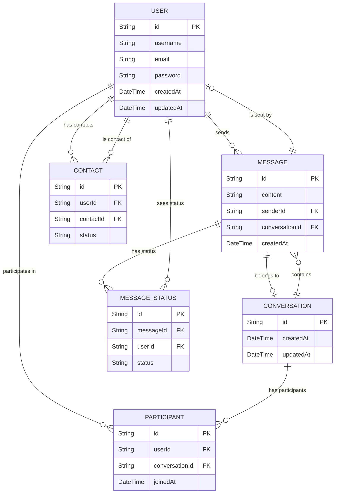

# Diolog
## Stop time, start chatting. Welcome to Diolog! ZA WARUDO!

```mermaid
erDiagram
    USER {
        String id PK
        String username
        String email
        String password
        DateTime createdAt
        DateTime updatedAt
    }
    
    MESSAGE {
        String id PK
        String content
        String senderId FK
        String conversationId FK
        DateTime createdAt
    }
    
    CONVERSATION {
        String id PK
        DateTime createdAt
        DateTime updatedAt
    }
    
    PARTICIPANT {
        String id PK
        String userId FK
        String conversationId FK
        DateTime joinedAt
    }
    
    MESSAGE_STATUS {
        String id PK
        String messageId FK
        String userId FK
        String status
    }
    
    CONTACT {
        String id PK
        String userId FK
        String contactId FK
        String status
    }
    
    USER ||--o{ MESSAGE : "sends"
    MESSAGE ||--o| USER : "is sent by"
    
    CONVERSATION ||--o{ MESSAGE : "contains"
    MESSAGE ||--o| CONVERSATION : "belongs to"
    
    USER ||--o{ PARTICIPANT : "participates in"
    CONVERSATION ||--o{ PARTICIPANT : "has participants"
    
    MESSAGE ||--o{ MESSAGE_STATUS : "has status"
    USER ||--o{ MESSAGE_STATUS : "sees status"
    
    USER ||--o{ CONTACT : "has contacts"
    USER ||--o{ CONTACT : "is contact of"
```
